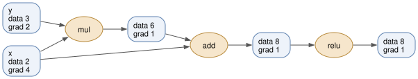
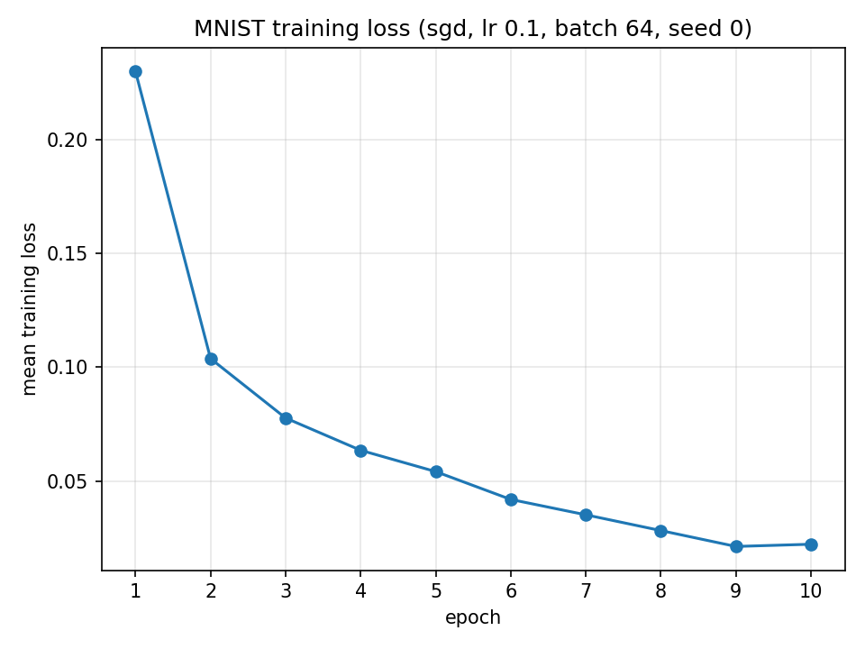
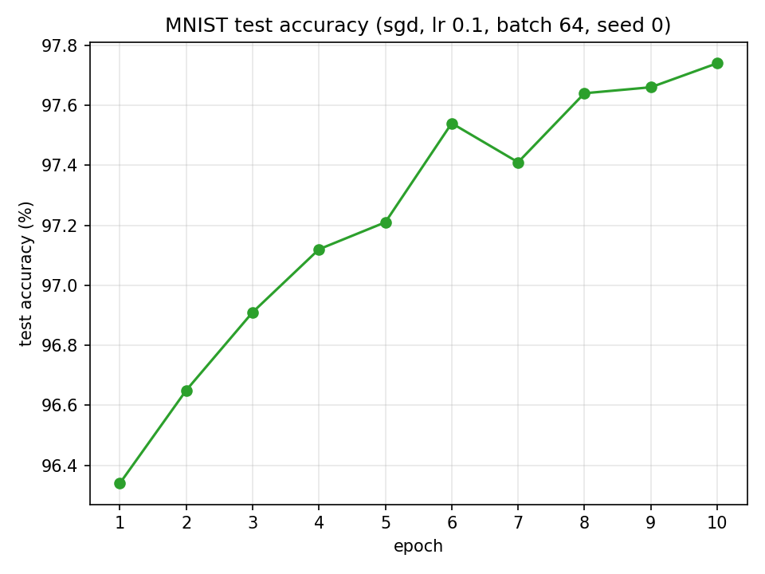

# numgrad

Reverse-mode automatic differentiation in ~500 lines of NumPy.

[](https://github.com/mandypengg/numgrad/actions/workflows/ci.yml)



That is the tape numgrad builds for `z = (x * y + x).relu()` at x = 2 and y = 3,
drawn by the library itself with `python examples/render_graph.py`. Read it
backwards and you have the whole idea: every box carries a value and a gradient,
every ellipse is an op that knows its own derivative, and `x` is one node with
two edges leaving it, so its gradient is the sum along both paths, 3 from the
multiply and 1 from the add.

The point of this project is to make the mechanics of backpropagation legible.
Every tensor records how it was computed, `backward()` walks that record in
reverse and applies the chain rule one op at a time, and there is no layer of
abstraction between what you read and what runs. No PyTorch, no JAX, no
autograd, not even to check the answers: the gradients are checked against
finite differences of the library's own forward pass.

The ~500 lines are executable statements: 443 of them are the autodiff itself,
meaning the tape, the ops, the layers, the optimizers, and the gradient checker.
The rest of the package is MNIST loading and the drawing above. Counting the
comments and docstrings it comes to about 1,400 lines, and that difference is
the explanation of why each backward pass has the form it does, which is the
part worth reading.

## Install

```bash
git clone https://github.com/mandypengg/numgrad.git
cd numgrad
pip install -e ".[dev]"
```

NumPy is the only runtime dependency. The dev extra adds pytest, matplotlib for
the example plots, scikit-learn, which is used for exactly one thing,
downloading MNIST, and graphviz for the drawing at the top. Redrawing it also
needs the `dot` binary (`brew install graphviz`, or `apt install graphviz`);
nothing else in the project does.

## Usage

```python
import numpy as np
from numgrad import SGD, Linear, ReLU, Sequential, Tensor, softmax_cross_entropy

rng = np.random.default_rng(0)
x = Tensor(rng.standard_normal((32, 4)))
labels = np.arange(32) % 3

model = Sequential(Linear(4, 16, rng=rng), ReLU(), Linear(16, 3, rng=rng))
optimizer = SGD(model.parameters(), lr=0.1, momentum=0.9)

for _ in range(100):
    optimizer.zero_grad()                            # gradients accumulate, so clear them
    loss = softmax_cross_entropy(model(x), labels)
    loss.backward()                                  # reverse walk over the tape
    optimizer.step()

print(float(loss.data))                              # 1.8283 at the first step, 0.1303 here
```

## MNIST

A 784 -> 128 -> 10 network with one ReLU reaches **97.74% test accuracy** in ten
epochs, in about 40 seconds:

```bash
python examples/train_mnist.py
```

That is the whole command. It downloads MNIST on the first run and caches it,
and the number is reproducible: the default seed fixes both the weight
initialization and the shuffling, so the run replays digit for digit. Pass
`--optimizer adam`, `--lr`, `--epochs`, or `--seed` to change it.





## Why the gradient checks are the correctness argument

An autodiff library is one place where being wrong is quiet. A sign error in a
backward pass does not raise; it produces a model that trains slightly worse
than it should, and you spend a week blaming the learning rate. So every
backward pass in this library is checked against a central finite difference of
its own forward pass:

```
(f(x + h) - f(x - h)) / 2h
```

one scalar entry at a time, over every entry of every input, at random points,
to a relative tolerance of 1e-6. The checker is
[`numgrad/gradcheck.py`](numgrad/gradcheck.py), 49 tests call it, and between
them they cover all 16 primitive ops.

The reason a per-op check is worth this much is that the chain rule composes.
The gradient of a whole network is a product of local gradients, so if every
primitive's local gradient is correct, and the tape visits nodes in a correct
reverse topological order, the composite gradient is correct too, and it is
correct by construction rather than by luck. The suite tests both halves of
that claim separately: the per-op checks pin the local gradients, and further
checks run a full multi-layer network through the loss and difference *that*,
which is what would catch a broken traversal or a gradient that failed to
accumulate across two uses of the same tensor.

Two design choices exist to make this argument hold rather than merely look
good. Everything is float64, because at float32 the roundoff in the numerator
above swamps the signal and a 1e-6 tolerance stops meaning anything. And
gradients accumulate with `+=` and are only ever cleared by an explicit
`zero_grad()`, so a tensor used twice in a graph receives both contributions;
the composite checks are what prove it does.

What this does not give you is a proof in the formal sense. It is a check at
sampled points, not over all inputs, and it deliberately stays away from kinks:
ReLU is not differentiable at 0, the backward pass takes the subgradient 0
there, and no finite difference straddling 0 will agree with that choice, so
those tests seed their inputs away from it. Within those limits, though, the
claim is strong and it is mechanically re-checked on every push: the analytic
gradients agree with the numeric ones to within a relative 1e-6, and any edit
that breaks one turns the suite red.

## Layout

| Path | What is in it |
| --- | --- |
| [`numgrad/tensor.py`](numgrad/tensor.py) | `Tensor`, the tape, and `backward()` |
| [`numgrad/ops.py`](numgrad/ops.py) | Forward and backward for each primitive op |
| [`numgrad/nn.py`](numgrad/nn.py) | Layers, initialization, losses |
| [`numgrad/optim.py`](numgrad/optim.py) | SGD with momentum, Adam |
| [`numgrad/gradcheck.py`](numgrad/gradcheck.py) | The finite-difference checker |
| [`numgrad/data.py`](numgrad/data.py) | MNIST loading, caching, batching |
| [`numgrad/viz.py`](numgrad/viz.py) | Drawing a tape with Graphviz |

## Tests

```bash
pytest                  # 176 tests
pytest -k gradcheck     # 61: the gradient checks, and the tests of the checker
pytest -m "not slow"    # skips the one test that downloads MNIST
```

CI runs the suite on Python 3.10, 3.11, and 3.12 with `-m "not slow"`, so the
gradient checks run on every push and nothing in the pipeline depends on a
third-party download staying up.
